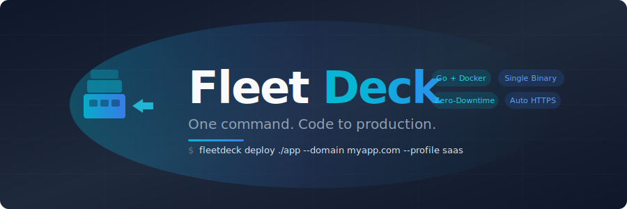

<p align="center">
  
</p>

<p align="center">
  <a href="#quick-start">Quick Start</a> &bull;
  <a href="#the-one-command-workflow">One Command</a> &bull;
  <a href="#deployment-profiles">Profiles</a> &bull;
  <a href="#server-provisioning">Server Setup</a> &bull;
  <a href="#how-to-use-fleetdeck">Usage Guide</a> &bull;
  <a href="#documentation">Docs</a>
</p>

<p align="center">
  <a href="https://github.com/Artaeon/fleetdeck/actions"></a>
  <a href="https://opensource.org/licenses/MIT"></a>
  <a href="https://goreportcard.com/report/github.com/Artaeon/fleetdeck"></a>
</p>

---

**FleetDeck** is a single-binary deployment platform that takes your application from code to production with one command. It detects your stack, provisions your server, deploys with zero downtime, sets up HTTPS, configures CI/CD, monitors health, and handles backups. No Kubernetes. No YAML hell. Just ship.

```bash
fleetdeck deploy ./my-saas --server root@server.ip --domain myapp.com --profile saas
```

That one command connects to your server, detects your app (Next.js, Go, Python, whatever), generates a Docker Compose stack with PostgreSQL + Redis + S3 + email, configures Traefik for automatic HTTPS, deploys your containers, and sets up GitHub Actions CI/CD. Done.

---

## The Problem

Every new project is the same 30-minute ritual:

1. SSH into server, create a Linux user
2. Generate SSH keys for CI/CD
3. Write a Dockerfile
4. Write docker-compose.yml with Traefik labels
5. Configure .env with database passwords
6. Create GitHub repo, set deploy secrets
7. Write a GitHub Actions workflow
8. Set up DNS records
9. Configure backups
10. Pray nothing breaks

Now multiply that by every project you ship. **FleetDeck eliminates all of it.**

## What Makes FleetDeck Different

Unlike Kubernetes (too complex), Coolify/CapRover (opinionated PaaS), or plain Docker scripts (too manual), FleetDeck sits in the sweet spot:

- **Not a PaaS** -- you own your server, your configs, your data
- **Not an orchestrator** -- no clusters, no service mesh, no learning curve
- **Just automation** -- it does exactly what you'd do manually, but in seconds
- **Single binary** -- one `go build`, one file, runs everywhere

---

## Quick Start

### Install

```bash
git clone https://github.com/Artaeon/fleetdeck.git
cd fleetdeck
make build
sudo make install
```

**Requirements:** Linux (Ubuntu 22.04+, Debian 12+). Go 1.23+ for building. Docker and Traefik are installed automatically by `server setup`.

### The One-Command Workflow

**Step 1:** Provision your server (once):
```bash
fleetdeck server setup root@your-server-ip \
  --domain yourdomain.com \
  --email you@email.com \
  --insecure  # TOFU: auto-saves host key on first connect
```

This installs Docker, Traefik (with automatic Let's Encrypt HTTPS), UFW firewall, fail2ban, swap, and hardens SSH. Idempotent -- safe to re-run.

**Step 2:** Deploy your app:
```bash
fleetdeck deploy ./my-app \
  --server root@your-server-ip \
  --domain myapp.yourdomain.com \
  --profile saas
```

**Step 3:** There is no step 3. Your app is live at `https://myapp.yourdomain.com`.

### Already Have a Server?

```bash
# Initialize FleetDeck on your existing server
sudo fleetdeck init

# Import your existing Docker Compose projects
sudo fleetdeck discover
sudo fleetdeck discover import --all

# Create a new project
sudo fleetdeck create myapp --domain myapp.com --template node --profile server
sudo fleetdeck start myapp
```

---

## Smart Detection

FleetDeck analyzes your project and figures out what you need:

```bash
$ fleetdeck detect ./my-app

  Application detected!

  Property    Value
  Type        nextjs
  Language    typescript
  Framework   Next.js (App Router)
  Port        3000
  Database    yes
  Redis       yes
  Confidence  95%

  Recommended profile: saas
```

**Supported stacks:**

| Language | Frameworks | Detection Method |
|----------|-----------|-----------------|
| **Node.js** | Express, Fastify, Koa | package.json |
| **TypeScript** | Next.js, NestJS | package.json + app/ dir |
| **Python** | FastAPI, Django, Flask | requirements.txt, Pipfile, pyproject.toml |
| **Go** | Gin, Echo, Fiber | go.mod |
| **Rust** | Actix Web, Axum, Rocket | Cargo.toml |
| **Static** | HTML/CSS/JS | index.html |

Detection also identifies database usage (PostgreSQL, MySQL, MariaDB), Redis, Docker configs, and recommends the right deployment profile.

---

## Deployment Profiles

Profiles are pre-built infrastructure stacks. Instead of writing Docker Compose from scratch, pick a profile and FleetDeck generates everything.

```bash
fleetdeck profiles           # List all profiles
fleetdeck profile saas       # Inspect a specific profile
```

| Profile | What You Get | Best For |
|---------|-------------|----------|
| **`bare`** | App container + Traefik HTTPS | Stateless APIs, microservices |
| **`server`** | App + PostgreSQL + Redis | Backend APIs, web apps |
| **`saas`** | App + PostgreSQL + Redis + S3 (MinIO) + Email (Mailpit) | Full SaaS products |
| **`static`** | Nginx + CDN headers + gzip + SPA fallback | Landing pages, docs, SPAs |
| **`worker`** | Worker process + Redis queue + PostgreSQL | Background job processors |
| **`fullstack`** | Frontend + Backend + PostgreSQL + Redis + S3 | Monorepo applications |

### The `saas` Profile

Everything you need for a production SaaS, generated in one command:

- **Your app** with Traefik routing and automatic HTTPS
- **PostgreSQL** with health checks, persistent storage, `pg_isready` probes
- **Redis** with AOF persistence, 512MB memory limit, LRU eviction
- **MinIO** (S3-compatible) at `s3.yourdomain.com` for file uploads
- **Mailpit** at `mail.yourdomain.com` for email testing/SMTP relay
- Auto-generated `.env` with cryptographically random passwords

### The `fullstack` Profile

For monorepos with separate frontend and backend:

- Frontend at `yourdomain.com` (Next.js, React, etc.)
- Backend API at `api.yourdomain.com`
- Separate Dockerfiles (`Dockerfile.frontend`, `Dockerfile.backend`)
- Shared database, cache, and object storage

---

## Deployment Strategies

```bash
fleetdeck deploy ./app --strategy bluegreen --domain app.com
```

| Strategy | How It Works | Downtime |
|----------|-------------|----------|
| **`basic`** | `docker compose up -d` | Brief (~seconds) |
| **`bluegreen`** | New containers alongside old, health check, switch traffic | **Zero** |
| **`rolling`** | Update services one at a time with `--no-deps` | **Zero** |

Blue/green deployment flow:
1. Start new containers under a temporary project name
2. Run health checks against the new containers
3. If healthy: stop old containers, promote new ones
4. If unhealthy: remove new containers, old ones keep running

**Per-project locking** prevents concurrent deployments of the same project.

---

## Server Provisioning

```bash
fleetdeck server setup root@143.198.1.1 \
  --domain example.com \
  --email you@example.com \
  --swap 4
```

| Component | What Gets Configured |
|-----------|---------------------|
| **System** | apt update/upgrade, curl, git, htop, fail2ban, UTC timezone |
| **Docker** | Docker Engine + Compose v2 from official Docker repo |
| **Traefik** | v3 reverse proxy, Let's Encrypt HTTPS, HTTP-to-HTTPS redirect |
| **Firewall** | UFW: SSH (22), HTTP (80), HTTPS (443) only |
| **Swap** | Configurable swap file (default 2GB) |
| **SSH** | Password auth disabled, root login disabled |

Every step is **idempotent** -- run it again after six months and it just verifies everything is still configured correctly.

**SSH Security:** Uses Trust On First Use (TOFU) -- the host key is verified against `~/.ssh/known_hosts`. On first connection with `--insecure`, the key is automatically saved for future verification.

---

## DNS Management

```bash
# Auto-configure root + wildcard A records
fleetdeck dns setup example.com 143.198.1.1 --provider cloudflare --token cf_xxx

# List all records
fleetdeck dns list example.com --token cf_xxx
```

Creates `example.com` and `*.example.com` A records pointing to your server. Supports multi-level TLDs (`.co.uk`, `.com.au`, etc.) correctly.

---

## Environment Management

```bash
fleetdeck env create myapp staging --domain staging.myapp.com
fleetdeck env create myapp preview --domain preview.myapp.com --branch feature/redesign
fleetdeck env promote myapp staging production
```

Each environment gets its own Docker Compose stack, domain, and configuration. Promotion copies config and images from one environment to another.

---

## Health Monitoring

```bash
# Continuous monitoring with Slack alerts
fleetdeck monitor start myapp --interval 30s --slack https://hooks.slack.com/xxx

# One-off health check (great for CI/CD)
fleetdeck monitor check myapp
```

- Alerts fire on **state transitions only** (healthy -> unhealthy, recovery) -- no alert fatigue
- Configurable failure threshold (default: 3 consecutive failures before alerting)
- **State persists to disk** -- survives process restarts
- Providers: Webhook (JSON POST), Slack (formatted messages), Email (SMTP)

---

## Backup & Disaster Recovery

```bash
# Full backup (config + database dumps + volume archives)
fleetdeck backup create myapp

# List backups
fleetdeck backup list myapp

# Restore (auto-snapshots current state first)
fleetdeck backup restore myapp <backup-id>

# Quick rollback to latest snapshot
fleetdeck rollback myapp --latest

# Schedule daily backups
fleetdeck schedule enable myapp
```

**Automatic snapshots** before every stop, restart, destroy, and restore. You can always go back, even after a restore.

**What gets backed up:** docker-compose.yml, .env, Dockerfile, PostgreSQL dumps (`pg_dump`), MySQL dumps (`mysqldump`), Docker volume archives, SHA256 manifest.

**Retention:** configurable max count, max age (days), max total size (GB). The most recent backup of each type is never deleted.

---

## Web Dashboard & API

```bash
fleetdeck dashboard --addr :8420
```

Browser-based project management: real-time server stats, project grid, start/stop/restart controls, live log viewer, backup browser, deployment history, and GitHub webhook integration.

Full REST API at `/api/projects`, `/api/status`, `/api/audit`, `/api/webhook/github`.

---

## How to Use FleetDeck

### Your First Deploy (5 minutes)

**Prerequisites:** A VPS (Hetzner, DigitalOcean, Linode -- $5/mo works), a domain, and your app code.

```bash
# 1. Build FleetDeck
git clone https://github.com/Artaeon/fleetdeck.git && cd fleetdeck
make build && sudo make install

# 2. Provision your server
fleetdeck server setup root@YOUR_SERVER_IP \
  --domain yourdomain.com \
  --email you@email.com \
  --insecure

# 3. Set up DNS (auto if you have Cloudflare)
fleetdeck dns setup yourdomain.com YOUR_SERVER_IP \
  --provider cloudflare --token YOUR_CF_TOKEN

# 4. Deploy your app
cd /path/to/your/app
fleetdeck deploy . \
  --server root@YOUR_SERVER_IP \
  --domain app.yourdomain.com \
  --profile saas

# Your app is live at https://app.yourdomain.com
```

### Day-to-Day Workflow

```bash
# Push code -> GitHub Actions auto-deploys
git push origin main

# Check project status
fleetdeck list
fleetdeck info myapp
fleetdeck logs myapp -f

# Deploy a new project
fleetdeck deploy ./new-project --server root@server --domain new.yourdomain.com

# Create a staging environment
fleetdeck env create myapp staging

# Monitor health
fleetdeck monitor start myapp --slack https://hooks.slack.com/xxx

# Backup before risky changes
fleetdeck backup create myapp
# ... make changes ...
fleetdeck rollback myapp --latest  # oops, revert
```

### Managing Multiple Projects

FleetDeck is built for running 5-50 projects on a single server:

```bash
$ fleetdeck list

NAME         DOMAIN                  STATUS    TEMPLATE  PROFILE
myapp        myapp.com               running   nextjs    saas
api          api.company.com         running   go        server
blog         blog.company.com        running   static    static
worker       -                       running   node      worker
staging      staging.myapp.com       stopped   nextjs    saas
```

Each project gets its own Linux user, SSH keys, Docker network, and backup schedule. Complete isolation.

---

## Documentation

### Complete Command Reference

| Command | Description |
|---------|-------------|
| **Deploy & Detect** | |
| `fleetdeck deploy [dir]` | One-command deploy (local or remote via SSH) |
| `fleetdeck detect [dir]` | Auto-detect app type and recommend profile |
| `fleetdeck profiles` | List all deployment profiles |
| `fleetdeck profile <name>` | Inspect a profile (add `--compose` for template) |
| **Server** | |
| `fleetdeck server setup <user@host>` | Provision a fresh server |
| `fleetdeck init` | Initialize FleetDeck locally |
| `fleetdeck upgrade` | Self-update to latest release |
| **Projects** | |
| `fleetdeck create <name>` | Create project (`--profile`, `--template`, `--domain`) |
| `fleetdeck start / stop / restart <name>` | Lifecycle management |
| `fleetdeck destroy <name>` | Remove project (with optional data retention) |
| `fleetdeck list / info / logs / status` | Information and monitoring |
| **DNS** | |
| `fleetdeck dns setup <domain> <ip>` | Auto-configure A + wildcard records |
| `fleetdeck dns list / delete` | Record management |
| **Environments** | |
| `fleetdeck env create / list / promote / delete` | Multi-environment management |
| **Monitoring** | |
| `fleetdeck monitor start <name>` | Continuous health monitoring |
| `fleetdeck monitor check <name>` | Single health check (exits non-zero if unhealthy) |
| **Backup** | |
| `fleetdeck backup create / list / restore` | Full backup and restore |
| `fleetdeck rollback <name>` | Quick rollback to any snapshot |
| `fleetdeck snapshot <name>` | Quick snapshot |
| `fleetdeck schedule enable / disable / list` | Scheduled backups via systemd |
| **Discovery** | |
| `fleetdeck discover` | Scan server for existing Docker Compose projects |
| `fleetdeck discover import` | Import discovered projects |
| `fleetdeck sync` | Reconcile database with actual system state |

### Configuration

```toml
# /etc/fleetdeck/config.toml

[server]
base_path = "/opt/fleetdeck"
domain = "fleet.yourdomain.com"
encryption_key = "your-strong-passphrase"
api_token = "dashboard-auth-token"
webhook_secret = "github-webhook-secret"

[traefik]
network = "traefik_default"
entrypoint = "websecure"
cert_resolver = "myresolver"

[github]
default_org = "your-github-org"

[defaults]
template = "node"
postgres_version = "15-alpine"

[deploy]
strategy = "basic"              # basic, bluegreen, rolling
default_profile = "server"
timeout = "5m"

[monitoring]
enabled = false
interval = "30s"
timeout = "10s"
failure_threshold = 3

[dns]
provider = "cloudflare"

[backup]
base_path = "/opt/fleetdeck/backups"
max_manual_backups = 10
max_snapshots = 20
max_age_days = 30
max_total_size_gb = 5
auto_snapshot = true

[audit]
enabled = true
log_path = "/var/log/fleetdeck/audit.log"
```

Sensitive values can be set via environment variables: `FLEETDECK_API_TOKEN`, `FLEETDECK_WEBHOOK_SECRET`, `FLEETDECK_ENCRYPTION_KEY`, `FLEETDECK_DNS_TOKEN`, `FLEETDECK_MONITORING_SLACK`.

### Security

| Layer | Implementation |
|-------|---------------|
| Process isolation | Per-project Linux users with minimal privileges |
| SSH | Ed25519 keys, TOFU host verification, restricted to `docker compose` only |
| Secrets | AES-256-GCM at rest, PBKDF2 key derivation (100K iterations) |
| Webhooks | HMAC-SHA256 signature verification |
| API | Bearer token auth, per-IP rate limiting (10 req/s) |
| Network | Per-project Docker networks, Traefik TLS termination |
| HTTP | CSP, X-Frame-Options, X-Content-Type-Options, Referrer-Policy |
| Firewall | UFW: SSH + HTTP + HTTPS only |
| Input validation | Shell injection prevention, path traversal protection |
| Deployment | Per-project file locking prevents concurrent deploys |
| Audit | Structured JSON logs for every operation |

---

## Development

```bash
make build          # Build binary
make test           # Run all tests
make test-race      # Run with race detection
make test-cover     # Generate coverage report
make vet            # Run go vet
make lint           # Run golangci-lint
make release        # Build release binaries (amd64 + arm64)
```

### Test Coverage

**883 test functions** across **59 test files**. All tests pass. Zero race conditions.

| Package | Coverage | Tests |
|---------|----------|-------|
| detect | **99.1%** | 78 |
| profiles | **95.1%** | 54 |
| bootstrap | **93.9%** | 56 |
| config | **90.7%** | 26 |
| environments | **88.7%** | 51 |
| dns | **85.7%** | 40 |
| monitor | **82.1%** | 56 |
| project | **73.2%** | 39 |
| deploy | **32.6%** | 39 |
| remote | **9.0%** | 36 |

Deploy and remote have lower unit test coverage because they execute `docker compose` and SSH commands that require real infrastructure. **Integration tests** in CI run these against real Docker and SSH containers.

### CI Pipeline

Every push runs: build, vet, race-detected tests, coverage report, Docker integration tests, and SSH integration tests. See `.github/workflows/ci.yml`.

---

## Roadmap

- [x] Smart app detection (Node, Python, Go, Rust, static)
- [x] 6 deployment profiles (bare, server, saas, static, worker, fullstack)
- [x] One-command remote deployment via SSH
- [x] Server provisioning (Docker, Traefik, firewall, SSL)
- [x] Zero-downtime deployments (blue/green, rolling)
- [x] TOFU SSH host key verification
- [x] Per-project deployment locking
- [x] Health monitoring with Slack/webhook/email alerts + state persistence
- [x] DNS management with multi-level TLD support (Cloudflare)
- [x] Environment management (staging/production/preview)
- [x] Web dashboard with REST API
- [x] Backup, snapshot, and rollback system
- [x] Secret encryption (AES-256-GCM)
- [x] Audit logging with rotation
- [x] GitHub Actions CI with integration tests
- [ ] Hetzner and DigitalOcean DNS providers
- [ ] Resource monitoring (CPU, RAM per project via cgroups)
- [ ] Prometheus metrics endpoint
- [ ] Plugin system for custom hooks
- [ ] Multi-server support

---

## Contributing

See [CONTRIBUTING.md](CONTRIBUTING.md) for development setup, code style, and pull request guidelines.

## Security

See [SECURITY.md](SECURITY.md) for the security model and vulnerability reporting.

## License

MIT

---

Built by [Artaeon](https://github.com/Artaeon)
